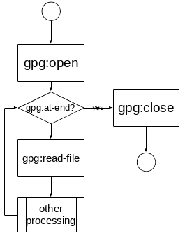

<!--

For the metadata block above here is the information that is missing

      orcid: 0000-0001-5186-9388
      affiliation: The James Hutton Institute, Craigiebuckler, Aberdeen, AB15 8QH, Scotland UK http://www.hutton.ac.uk
      email: doug.salt@hutton.ac.uk
      orcid: 0000-0002-8596-0590
      email: gary.polhill@hutton.ac.uk
      affiliation: The James Hutton Institute, Craigiebuckler, Aberdeen, AB15 8QH, Scotland UK http://www.hutton.ac.uk

To use this information, then I would have to write a custom template (look on
the web). I cannot be bothered % doing this at the moment, because I have no
idea of the formatting required on this article

-->

# Introduction

Cheap, publicly-accessible, distributed storage, colloquially known as the
"cloud" is becoming increasingly prevalent [@] and is increasingly used for the
storing of experimental data [@].  Storing experimental data in this way has
several advantages, such as any access to the internet allows instant access to
this data [@]. This means the data is effectively accessible anywhere.  Data
might be stored in a single location, or it might be distributed. The
convenience is that from the point of view of the consumer of the data, it all
appears to originate at a single web-based location [@]. Also  such data is
cloned and distributed in physical space for the purposes of fault-tolerance [@]
and thus can exist in many locations simultaneously [@]. Thus the chances
of it being lost are remote [@]. 

It is reasonably easy to use such cloud hosted data in NetLogo models. Some
institutions provide their own, cloud-based solutions, but most researchers
will use at least one of the following, major cloud storage providers such as
Dropbox [@], Microsoft's OneDrive [@] and Google Drive [@]. This list is by no
means meant to be comprehensive. It is our suspicion that some, less
technically aware NetLogo users are making use of the cloud without being aware
of the ramifications of doing so, but doing so because these resources are extremely convenient, 
cheap or more often free.  This problem may well arise because each of these
hosting companies provide tools that allow  user-transparent, local mounting of
such resources. These exist for the most prevalent platforms such as all
Microsoft Windows versions greater than 7 [@]; all versions of Android [@], and
Apple's two operating systems: OSX  and IOS[@]. This means that the "cloud"
storage appears as local storage on the local machine, and NetLogo models do
not need to be changed to access such data (other than changing a file name).
Indeed some users may not even be aware that the data they use is in the
"cloud" already.

The advantages listed above are also the method's disadvantages. The publicly
accessible nature of such data could violate regional privacy laws.  For
instance storing personally identifiable data of a sensitive nature without
sufficient safe-guards now violates the European GDPR [@]. The multiplicity of
the storage means the creator of the data has largely lost control over the
destruction of the data.  Most users of cloud data are unaware that even their
"scratch" data is stored in the cloud. That is intermediate files or snapshots
of works-in-progress. This becomes problematic when regulations or ethics
require that data is permanently and effectively deleted.  Also if such data
is of a personally identifiable nature, then, given GDPR requirements it is a
legal requirement of the researcher to store the data in particular
geographical areas and moreover ensure that when usage conditions specify
deletion, then deletion must, absolutely have taken place (ibid.).

The *only* way to ensure that effective deletion takes place when using such
utility computing infrastructure is to encrypt the data sufficiently that when key for
decrypting such data is withheld then the original data can no longer be
retrieved [@]. This is reasonably easy to achieve given that, with current
technology  a brute-force attack on a 128 bit AES encoded data would take on
average $1.02 \times 10_{18}$ years to work.
(https://www.eetimes.com/document.asp?doc_id=1279619). Doubling the size of
this key to 256 bits is thought to effectively protect such data from proposed
attacks such as those theoretically available if quantum computing proves to be
successful [@].  Destroying or withdrawing the encryption key therefore
effectively deletes such data. Thus encrypting data has both the desirable
properties of securing and ensuring appropriate deletion of the data.

It should be noted that most "cloud" provision does, as standard practice,
encrypt users' data [@]. The problem is that the provisioning entity controls
the keys, and is is not entirely clear what jurisdictional laws to apply given
the international nature of such providers. For example some doubt over data
jurisdiction currently exists between the European Union and the US government
(http://ec.europa.eu/justice/data-protection/international-transfers/adequacy/index_en.htm).
Thus it is impossible for a user of such services to guarantee the correct
jurisdictional standards are applied to their data, unless they take control of
the encryption themselves.

Having established the need for encryption, the remainder of this paper will
describe the installation and usage of NetLogo extension that will allow the
easy decryption of previously encrypted data sets. This extension will provide
for asymmetric and symmetric decryption such data sets. Each use-case will be
described that the extension has been designed to address by way of a small
example of usage. This will be followed by the usual discussion of issues
raised by the utility and use of this plug-in.

# The NetLogo Extension

Given that there is a need for such an encryption utility the problem becomes how
can such user-controlled encryption be implemented in a user-friendly manner
with minimal development. The last condition is important because coding
encryption correctly is a hard problem [@]. Insufficient expertise can lead to
attack opportunities due to weakness inherent in the developers' approaches
[@]. It therefore makes a great deal of sense to use existing and proven
software. In addition there is a requirement that users be able to encrypt
their data in the first place. This rules out the usual practice of utilising
an existing, programmatic libraries, created for specifically for the purposes
of encryption/decryption. Such libraries are indeed proven, but usually lack
the user-friendly encryption tools required to do the initial encryption. Such
tools although usually trivial to create crucially, still have to be developed,
and moreover, documented. Such requirements contain the possibility of the
introduction of bugs. Additionally the use of such libraries requires the
constant updating of the plug-in software, each time the library is updated -
say due to the discovery of a new attack or bug.  Such constraints can be
mitigated by the use of an external software suite. That is, a NetLogo
extension can be designed in such a manner to make calls to an "external"
program. An external program in this context is software that is independently
installed on a computer, is independent of NetLogo, and does not require
NetLogo to work. An example of this approach is the NetLogo R extension [@]
which obviously requires the independent installation of the R programming
suite for it to work with NetLogo. Thus, if any problems are found with the
external program, then just the external program needs updating. This does have
the disadvantage of introducing an additional step in the utilization of
NetLogo, but this is balanced not only be the additional utility and possible
multiple uses of the external software suite, but by the huge reduction in
complexity required to create the NetLogo extension. This has benefits in terms
increasing stability and formal correctness for the extension. 

The external tool chosen is GNU Privacy Guard, hereafter referred to as GPG.
This is a well known suite of programs that at its heart uses OpenPGP standard
as defined by RFC4880 (also known as PGP) [@]. Although designed primarily for
the purposes of safe-guarding communications, GnuPG allows the encryption of
data; it features a versatile key management system, along with access modules
for all kinds of public key directories. GPG is a command line tool with
features for easy integration with other applications. The software is mature
in that it was created in 1996 [@] and is widely used [@]. GPG provides a
series of command line tools and is available on virtually every single
computing platform.  The presumption will be that GPG has been installed on the
platform that is to run the NetLogo extension.

Because the extension uses GPG, the extension is very
small and requires the installation of just one jar file. The extension is
written in Scala [@] and built using sbt[@] and consists of the following
primitives:

+ `gpg:command`
+ `gpg:passphrase`
+ `gpg:attach`
+ `gpg:decrypt`
+ `gpg:read-line`
+ `gpg:at-end?`
+ `gpg:detach`

The normal flow would look like that shown in [@fig:flow]

{#fig:flow}

The installation jar can be found at  https://gitlab.com:doug.salt/gpg.git. The
file

`target/scala-2.12/gpg_2.12-0.1-SNAPSHOT.jar`

shoud be copied to a file named gpg.jar. This file should be placed in  the
extensions directory of the NetLogo installation. This is normally:

+ On Mac OS X: `/Applications/NetLogo 6.0.4/extensions`

+ On 64-bit Windows with 64-bit NetLogo or 32-bit Windows with 32-bit NetLogo:
  `C:\Program Files\NetLogo 6.0.4\app\extensions`

+ On 64-bit Windows with 32-bit NetLogo: 
  `C:\Program Files (x86)\NetLogo 6.0.4\app\extensions`

+ On Linux, or other *nix: the app/extensions subdirectory of the NetLogo
  directory extracted from the installation .tgz

Or, alternatively it can be placed in the same directory as the source for the
NetLogo model if the extension is not to be used globally.

The extension is invoked in the NetLogo code by adding the keyword `gpg` to the extensions keyword beginning the NetLogo model code.

## `gpg:command`

This sets the path of the `gpg` command if the `gpg` command is not in `$PATH`
for *nix system or `%PATH%` for Windows based systems. Its also allows the
specification of additional parameters to gpg, such as specifying a different
keyring location for `gnupg`. This can be called multiple times. Only the steps
subsequent to the call will be affected.

Some examples might be

```
gpg:command "/usr/bin/gpg"
```

or

```
gpg:command "

##  `gpg:passphrase`
##  `gpg:open`
##  `gpg:read-line`
##  `gpg:at-end?`
##  `gpg:close`


# Illustrations

## Symmetric encryption

## Asymmetric encryption


# Discussion and conclusions

This does have the disadvantage of introducing dependencies hitherto not present for NetLogo

In conjunction with Infrastructure as a Service (IaaS), then it is becoming
increasingly common to see NetLogo models.

We have developed a plugin that uses the Gnu PGP software to allow various
types of encryption on the data only. We could develop a plugin that
obfuscates the code, but we believe that this not only violates the code of
openness that surround the NetLogo community, but also possibly violates the GNU
Public License version 2 under which NetLogo is distributed. Taking somebody's open
code and concealing it legally violates the license, as this is precisely the
reason the license was created in the first place [@]. It also violates the
principle of open science as people should be able to inspect models to see the
reasoning that underlies them. This is increasingly important where such models
are used for policy decisions [@]

This code has been tested on Linux, Windows 7, Windows 10, and OSX so far
the code could be ported in entirety into NetLogo. There are java libraries
available that mirror the functionality of PGP [@]. However this has the
limitation of precluding the rapid release cycle of encryption software once
vulnerabilities have been discovered.

Specifically designed for GNUPG - there might be other encryption packages out there.

This is still to complicated for non-technical users.

This is susceptible to memory sniffing attacks.

# Acknowledgements
# Bibliography


